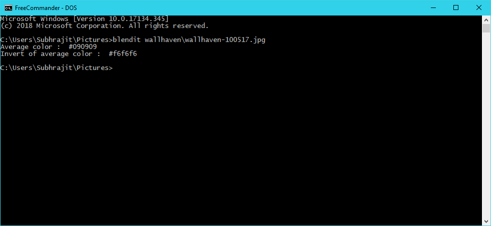

# blendit   
Script to get the "average" color of a image

## Dependencies

`pip install blendit`

## Usage

### As a module

```python
import blendit

rgb1, rgb2 = blendit.calculate("/path/to/image/") # returns a tuple containing 2 hex values

blendit.show_images(rgb1, rgb2) # shows image form of both hex values

```

### As a CLI

```bash
blendit filename

blendit --show filename
```

